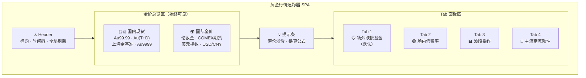
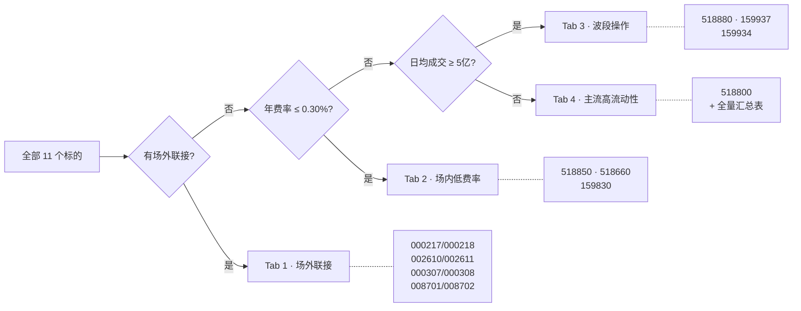
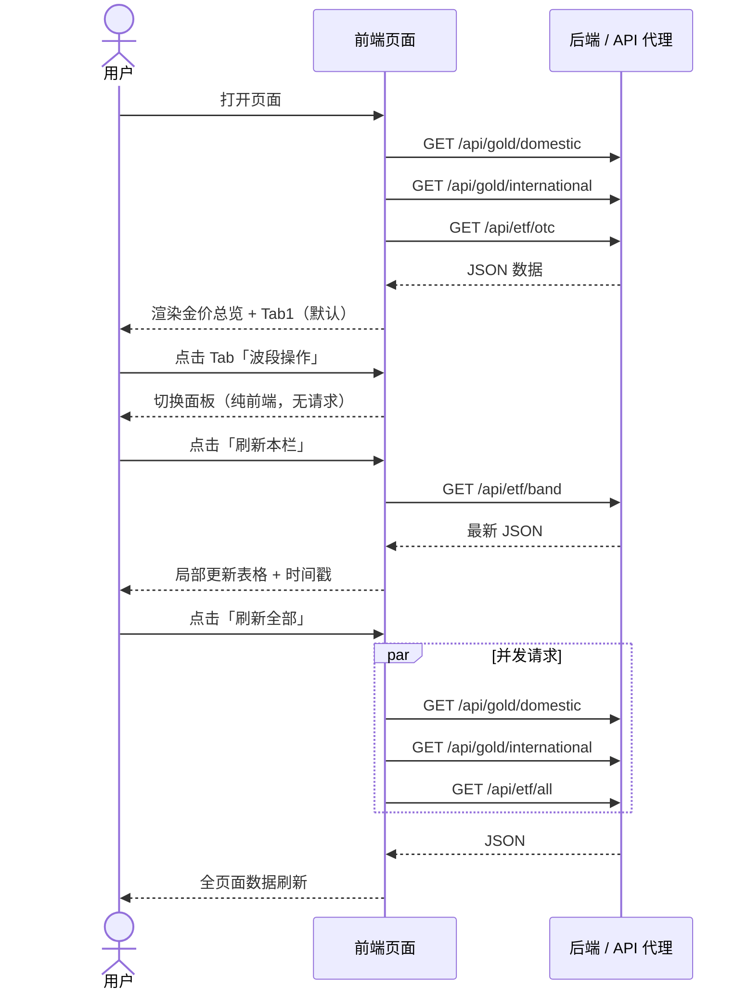
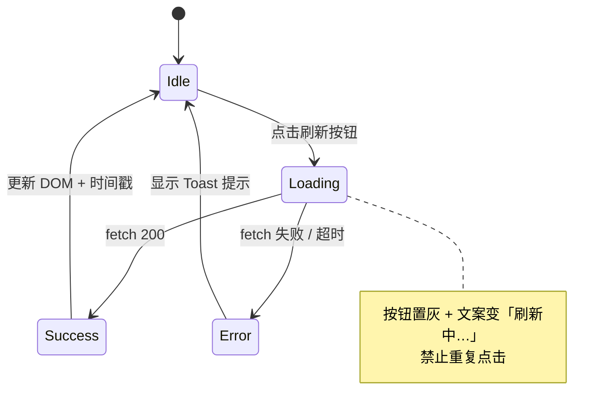
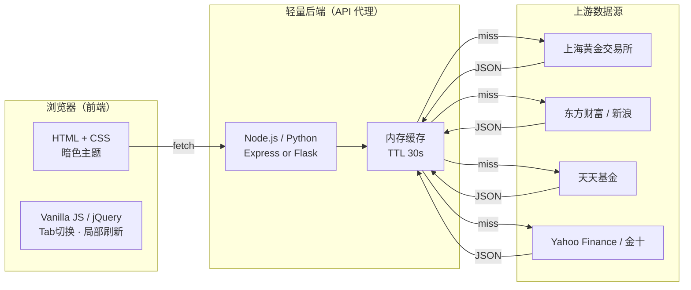
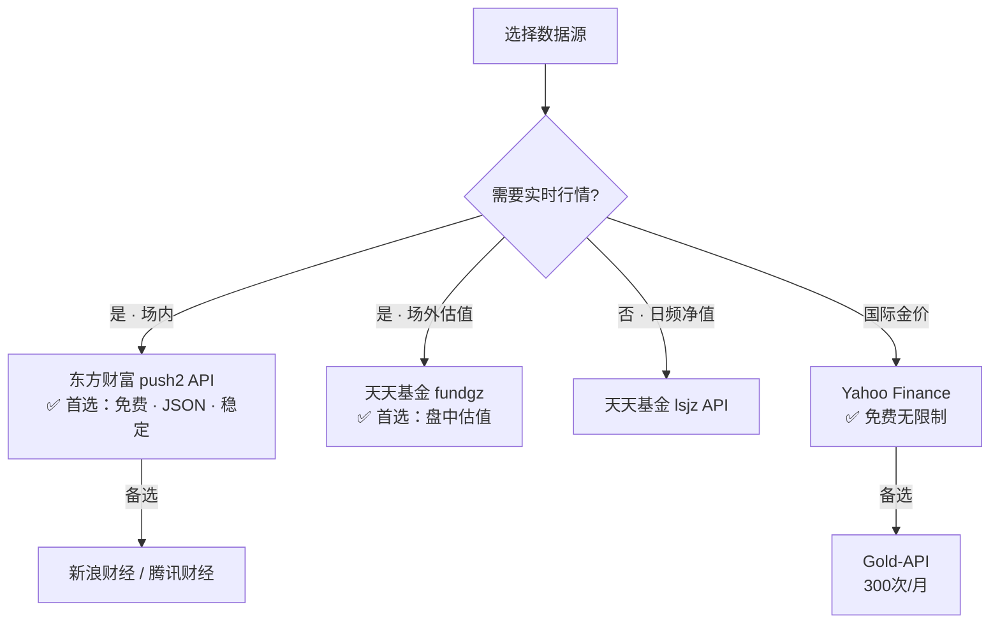

# 黄金行情追踪器 — 产品需求文档（PRD）

> **版本**：v1.0 · **日期**：2026-09-04 · **状态**：待评审

---

## 一、项目概述

构建一个**单页金融行情看板**，面向黄金投资新手，集中展示国内/国际金价与黄金 ETF 行情。页面风格对标**同花顺 / 东方财富**暗色主题，支持 Tab 分类浏览与**手动局部刷新**（无自动轮询）。

### 核心设计原则

| 原则 | 说明 |
|------|------|
| **零自动刷新** | 不设 `setInterval`，所有数据更新均由用户手动触发 |
| **局部刷新** | 每个模块（金价区 / 每个 Tab）可独立刷新，不重载整页 |
| **新手优先** | 默认 Tab 为场外联接基金，低费率品种置顶并标注推荐 |
| **严格标的范围** | 仅收录下方清单中的品种，不做扩展 |

---

## 二、标的清单（严格锁定）

> 以下 **7 只场内 ETF + 4 组场外联接基金** 为唯一数据标的，不得增减。

### 2.1 场内实物黄金 ETF（7 只）

| # | 基金简称 | 代码 | 交易所 | 年费率（管+托） | 最新规模（亿） | 日均成交额（亿） | 特点 |
|---|---------|------|--------|:---:|:---:|:---:|------|
| 1 | 华安黄金ETF | **518880** | 沪 | 0.60% | ~600 | 10~15 | 规模最大、流动性最强、支持两融 |
| 2 | 博时黄金ETF | **159937** | 深 | 0.60% | ~260 | 8~10 | 深市龙头、交易活跃、适合波段 |
| 3 | 易方达黄金ETF | **159934** | 深 | 0.60% | ~160 | 5~7 | 跟踪精度高、规模稳健 |
| 4 | 华夏黄金ETF | **518850** | 沪 | **0.20%** | ~160 | 5~7 | 费率最低、成本最优 |
| 5 | 工银黄金ETF | **518660** | 沪 | **0.20%** | ~50 | 2~4 | 费率最低、银行系、跟踪误差小 |
| 6 | 国泰黄金ETF | **518800** | 沪 | 0.60% | ~180 | 3~5 | 规模中等、波动平稳 |
| 7 | 上海金ETF | **159830** | 深 | 0.30% | ~20 | 1~2 | 费率适中、跟踪上海金基准 |

### 2.2 场外联接基金（4 组 / 8 个份额代码）

| # | 基金简称 | A 类代码 | C 类代码 | 对应场内 | 年费率 |
|---|---------|:---:|:---:|---------|:---:|
| 1 | 华安黄金ETF联接 | 000217 | 000218 | 518880 | 0.60% |
| 2 | 博时黄金ETF联接 | 002610 | 002611 | 159937 | 0.60% |
| 3 | 易方达黄金ETF联接 | 000307 | 000308 | 159934 | 0.60% |
| 4 | 华夏黄金ETF联接 | 008701 | 008702 | 518850 | 0.20% |

> ⚠️ 工银黄金ETF（518660）与上海金ETF（159830）目前未提供场外联接基金，仅支持场内交易。

---

## 三、页面布局架构

```
┌─────────────────────────────────────────────────────────────────┐
│  HEADER  标题 · 数据更新时间 · [刷新全部]                         │
├────────────────────────────┬────────────────────────────────────┤
│  国内现货金价（4 指标）     │  国际金价（4 指标）                 │
│  Au99.99 / Au(T+D)        │  伦敦金 / COMEX期货                 │
│  上海金基准 / Au9999       │  美元指数 / USD/CNY                 │
│              [局部刷新]    │              [局部刷新]              │
├────────────────────────────┴────────────────────────────────────┤
│  💡 提示条：沪伦溢价换算说明                                      │
├─────────────────────────────────────────────────────────────────┤
│  TAB 导航                                                        │
│  ┌──────────┬──────────┬──────────┬──────────────┐              │
│  │ 场外联接  │场内低费率 │ 波段操作  │ 主流高流动性  │              │
│  │ (默认)   │ (新手)   │          │              │              │
│  └──────────┴──────────┴──────────┴──────────────┘              │
│  TAB 内容区（表格 + 局部刷新按钮 + 底部提示）                     │
└─────────────────────────────────────────────────────────────────┘
```

### Mermaid 布局组件图



---

## 四、Tab 分类与标的分配

### 4.1 分类逻辑



### 4.2 各 Tab 标的明细

| Tab | 名称 | 包含标的 | 排序规则 | 默认状态 |
|:---:|------|---------|---------|:---:|
| 1 | 📋 场外联接基金 | 华夏C(008702) → 华安C(000218) → 博时C(002611) → 易方达C(002963)；A类折叠展示 | **低费率优先** → 规模降序 | ✅ 默认 |
| 2 | 🟢 场内低费率 | 518850 → 518660 → 159830 | 费率升序 → 规模降序 | |
| 3 | 📊 波段操作 | 159937 → 518880 → 159934 → 518800 | 日均成交额降序 | |
| 4 | 🏦 主流高流动性 | 全部 7 只场内 ETF | 规模降序（518880 置顶） | |

> **说明**：Tab 3 / Tab 4 存在标的重叠（如 518880 同时出现在两个 Tab），这是刻意设计——波段视角侧重价差与成交，全览视角侧重规模与费率。

---

## 五、交互流程

### 5.1 用户操作主流程



### 5.2 局部刷新状态机



---

## 六、金价展示区字段定义

### 6.1 国内现货（上海黄金交易所）

| 字段 | 数据源标识 | 单位 | 说明 |
|------|-----------|------|------|
| Au99.99 | `Au99.99` | 元/克 | 现货实盘合约 |
| Au(T+D) | `Au(T+D)` | 元/克 | 延期交收合约 |
| 上海金基准价 | `SHAU` | 元/克 | 每日 10:15 / 14:15 定价 |
| Au9999 | `Au9999` | 元/克 | 现货即期合约 |

### 6.2 国际金价

| 字段 | 数据源标识 | 单位 | 说明 |
|------|-----------|------|------|
| 伦敦金 | `XAU/USD` | 美元/盎司 | 现货基准 |
| COMEX 黄金期货 | `GC` (主力) | 美元/盎司 | 纽约商品交易所 |
| 美元指数 | `DXY` | 点 | 负相关参考 |
| 美元/人民币 | `USD/CNY` | 汇率 | 换算桥梁 |

### 6.3 换算提示条

```
国内金价 ≈ 国际金价 × USD/CNY ÷ 31.1035 + 境内溢价
```

页面动态计算并展示当前**沪伦溢价**（元/克）。

---

## 七、技术架构

### 7.1 整体架构



### 7.2 技术选型

| 层级 | 方案 | 说明 |
|------|------|------|
| 前端 | 原生 HTML + CSS + JS（或 jQuery） | 单文件部署，零构建 |
| 后端代理 | Node.js (Express) 或 Python (Flask) | 解决 CORS，聚合多数据源 |
| 缓存 | 内存缓存（`node-cache` / `cachetools`），TTL 30s | 避免高频请求被封 |
| 部署 | 静态页 → GitHub Pages / Vercel；后端 → Railway / 本地 | 个人工具级别 |

---

## 八、可用数据源

### 8.1 国际金价

| 数据源 | 接口 / 方式 | 费用 | 频率 | 备注 |
|--------|-----------|:---:|------|------|
| **Yahoo Finance** | `GC=F`（COMEX）、`XAUUSD=X`（伦敦金） | 免费 | 准实时 | 通过 `query1.finance.yahoo.com/v8/finance/chart/GC=F` 获取 |
| **金十数据** | `jin10.com` WebSocket / REST | 免费（基础） | 实时 | 需解析页面或抓取 |
| **Investing.com** | `cn.investing.com/commodities/gold` | 免费 | 准实时 | 可爬取，有反爬限制 |
| **Gold-API** | `gold-api.com/price/XAU` | 免费 300次/月 | 实时 | 简单 REST，适合原型 |
| **Metals-API** | `metals-api.com` | 免费 50次/月 | 日频 | 适合低频场景 |

### 8.2 国内现货金价

| 数据源 | 接口 / 方式 | 费用 | 备注 |
|--------|-----------|:---:|------|
| **上海黄金交易所** | `sge.com.cn` 官网行情 | 免费 | 权威源，但无公开 API，需爬取 |
| **新浪财经·贵金属** | `hq.sinajs.cn/list=AU9999,AU_T_D` | 免费 | 经典接口，返回 GBK 编码文本 |
| **东方财富·贵金属** | `push2.eastmoney.com/api/qt/stock/get?secid=118.AU9999` | 免费 | JSON 格式，字段丰富 |

### 8.3 场内 ETF 实时行情

| 数据源 | 接口示例 | 费用 | 备注 |
|--------|---------|:---:|------|
| **东方财富 push2** | `push2.eastmoney.com/api/qt/stock/get?secid=1.518880&fields=f43,f44,f45,f46,f47,f48,f57,f58,f170` | 免费 | `secid`：沪市 `1.` 深市 `0.`；`f43`=最新价 `f170`=涨跌幅 |
| **新浪财经** | `hq.sinajs.cn/list=sh518880,sz159937` | 免费 | 返回文本，需正则解析 |
| **腾讯财经** | `qt.gtimg.cn/q=sh518880,sz159937` | 免费 | 与新浪类似 |

### 8.4 场外基金净值

| 数据源 | 接口示例 | 费用 | 备注 |
|--------|---------|:---:|------|
| **天天基金（估值）** | `fundgz.1234567.com.cn/js/008702.js` | 免费 | 返回**盘中估值**，非确认净值 |
| **天天基金（净值）** | `api.fund.eastmoney.com/f10/lsjz?fundCode=008702` | 免费 | 返回历史净值列表 |
| **东方财富基金** | `push2.eastmoney.com/api/qt/stock/get?secid=0.008702` | 免费 | 同 ETF 接口，换 `secid` |

### 8.5 汇率 / 美元指数

| 数据源 | 接口 | 备注 |
|--------|------|------|
| **新浪财经** | `hq.sinajs.cn/list=fx_susdcny` | 美元/人民币 |
| **东方财富** | `push2.eastmoney.com/api/qt/stock/get?secid=100.DINIW` | 美元指数 DXY |
| **Yahoo Finance** | `CNY=X`、`DX-Y.NYB` | 同上 |

### 8.6 数据源优先级建议



> ⚠️ 以上第三方接口均为**非官方公开接口**，无 SLA 保障。建议后端加 30s 缓存 + 降级逻辑（某源超时则返回上次缓存）。

---

## 九、API 设计（后端代理层）

| 端点 | 方法 | 返回内容 | 上游源 |
|------|:---:|---------|--------|
| `/api/gold/domestic` | GET | 4 项国内现货指标 | 新浪 / 东财 |
| `/api/gold/international` | GET | 伦敦金 + COMEX + DXY + 汇率 | Yahoo / 金十 |
| `/api/etf/otc` | GET | 4 组场外基金净值 + 估值 | 天天基金 |
| `/api/etf/lowfee` | GET | 518850 / 518660 / 159830 | 东财 push2 |
| `/api/etf/band` | GET | 159937 / 518880 / 159934 / 518800 | 东财 push2 |
| `/api/etf/main` | GET | 全部 7 只场内 ETF | 东财 push2 |
| `/api/etf/all` | GET | 上述场内 + 场外合并 | 聚合 |

统一响应格式：

```json
{
  "code": 0,
  "ts": 1725451200,
  "data": [
    {
      "name": "华安黄金ETF",
      "code": "518880",
      "price": 5.985,
      "change_pct": 1.38,
      "volume": 1260000000,
      "nav": null
    }
  ]
}
```

---

## 十、非功能需求

| 项目 | 要求 |
|------|------|
| **刷新策略** | ❌ 无 `setInterval` / 自动轮询；✅ 仅手动触发 |
| **局部刷新** | 每个金价区块、每个 Tab 独立刷新，不重载页面 |
| **加载态** | 刷新时按钮置灰 + 文案变「刷新中…」，禁止重复点击 |
| **错误处理** | 请求超时 5s，失败显示 Toast「数据获取失败，请稍后重试」，保留上次数据 |
| **响应式** | 移动端隐藏次要列（成交额、规模），保留核心 4 列 |
| **配色** | 暗色背景 `#0d1117`，涨红 `#f85149`，跌绿 `#3fb950`，金色强调 `#d4a537` |
| **字体** | 数字使用等宽字体（`SF Mono` / `Fira Code` / `monospace`） |
| **合规提示** | 页面底部注明：数据仅供参考，不构成投资建议；数据延迟约 15s~5min |

---

## 十一、里程碑

| 阶段 | 内容 | 产出 |
|:---:|------|------|
| M0 | 本需求文档评审 | 确认标的、Tab 分类、数据源 |
| M1 | 前端静态页面（模拟数据） | 单文件 `index.html`，Tab + 布局 + 样式 |
| M2 | 后端代理层 | Node/Python 服务，5~7 个 API 端点 |
| M3 | 前后端联调 | 真实数据渲染，局部刷新跑通 |
| M4 | 部署 & 打磨 | Vercel / Railway 部署，移动端适配 |

---

*文档结束。如需调整 Tab 分类逻辑、增减字段或更换数据源，请在此文档上批注后同步。*